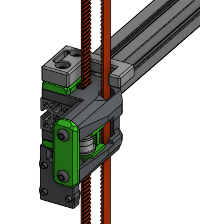
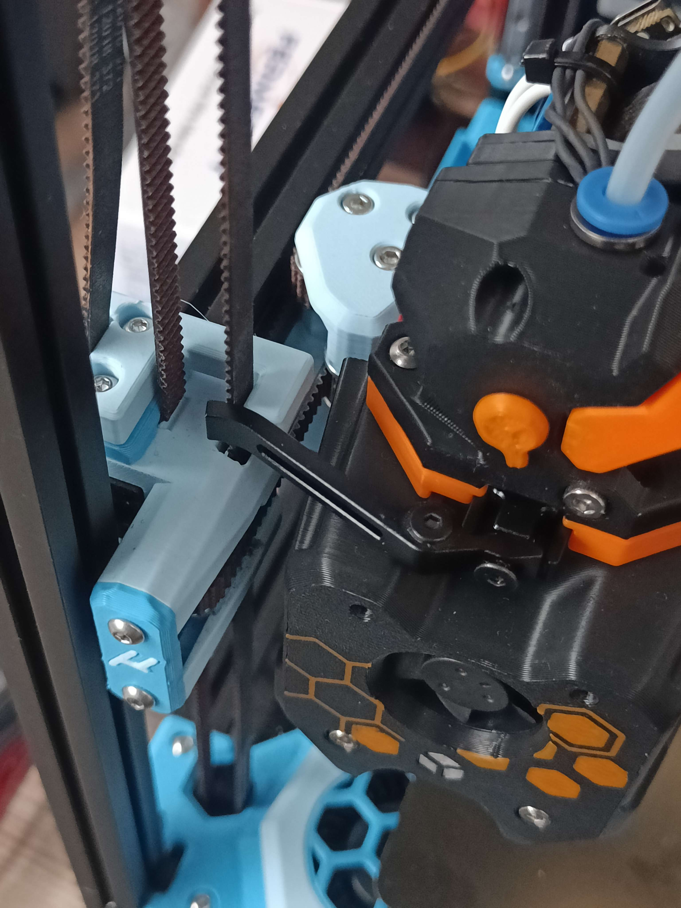

# Micron Crossbow arm

This mod places an actuator arm for the [Crossbow](https://github.com/DW-Tas/Crossbow-Filament-Cutter) filament cutter on top of the front idler of an R1 Micron, making assembly much easier than an arm mounted to the extrusion and requiring no extra nuts to be loaded into the extrusion.

The provided files fit an [A4T](https://github.com/Armchair-Heavy-Industries/A4T) on [Xol carriage](https://github.com/Armchair-Heavy-Industries/Xol-Toolhead/tree/main/STL/Xol-Carriage).

[CAD](https://cad.onshape.com/documents/703f9d51b782b5fa1c0501b2/w/853ff6936f42186f45f9b767/e/4aaf6876d30aa1a9b77c1400?configuration=Actuator_X_offset%3D0.008%2Bmeter%3BActuator_Y_offset%3D0.007%2Bmeter%3BActuator_Z_offset%3D0.0015%2Bmeter%3BActuator_size%3D0.006%2Bmeter%3BArrange_for_pronting%3Dfalse&renderMode=0&uiState=6956ae21432fef74420216ce) is available and parameterized for easy adjustment. This should be able to fit any number of toolhead-carriage combinations using Crossbow.

## Happy Hare cut tip macro

The [provided cfg](./mmu_cut.cfg) contains an adjusted `MMU_CUT_TIP` macro which will support a diagonal movement, preventing the crossbow's lever stabbing the belt as it extends.

Include the .cfg, adjust your dimensions in line 76ff and activate it by setting `form_tip_macro: _MY_MMU_CUT_TIP` in `mmu_parameters.cfg`.

`_MY_MMU_CUT_TIP_VARS` in the provided macro is required to keep Happy Hare from complaining. The configuration of all parameters beside the cutting locations should still be done in `_MMU_CUT_TIP_VARS` in `mmu_macro_vars.cfg`.

## Acknowledgements

Special thanks to hartk for the idea for this mod and the Micron, and to DW Tas for A4T and Crossbow.
