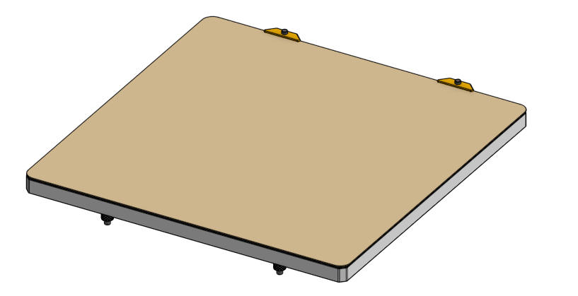
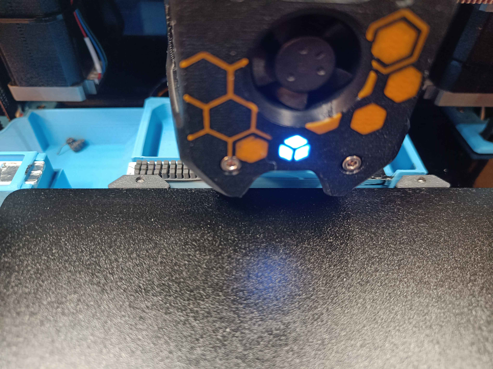

# Micron tab-less sheet alignment peg

My very [favorite build plate](https://alchemy3d.de/products/satin-pei-doublesided) does not come with the tabs on the rear that the Micron's aligment screws expect. This trivial printed piece will help align a 185mm print sheet which does not have tabs on a Micron.

The hole is sized for a very loose thread forming. There's no need to undo your bed, simply place the chamfer on the screws which you no doubt have already placed in your bed, and give it a firm push.

