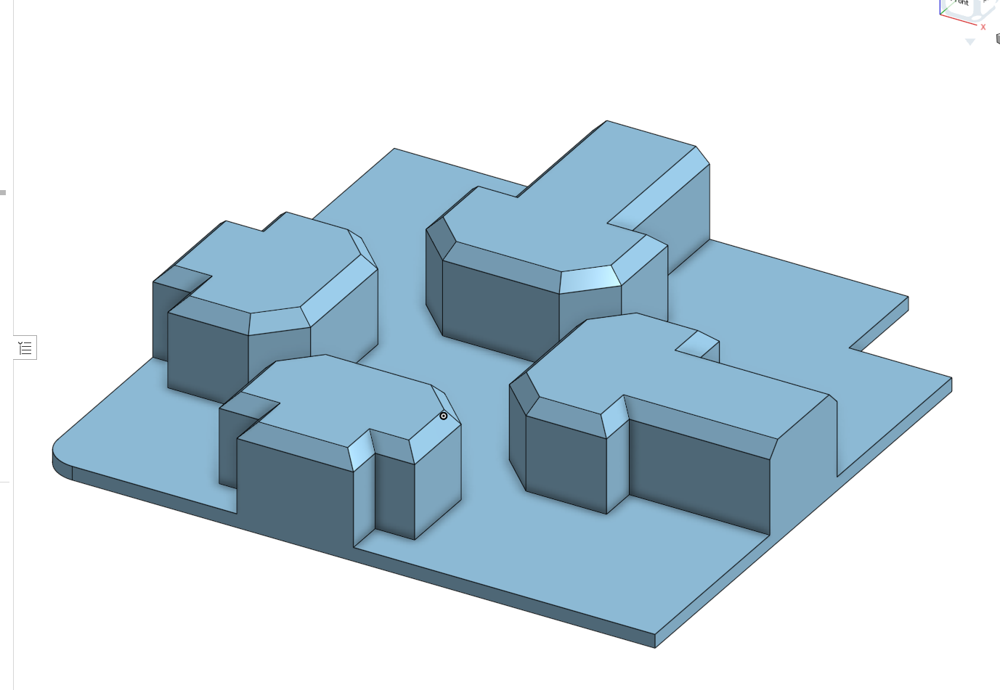

# 1515 TPU extrusion stopper

This is a very simple stopper for the corner extrusions of a 1515 printer to keep warm air and smells inside. It also works nicely to cover any sharp edges left by cutting the extrusion.

Print as oriented in any TPU you have on hand and plop onto your corners!

Dimensions are off Misumi drawings but it fits Formbot extrusions and so should also fit LDO extrusions. Fits under stock Micron panel clips if you use a bit of force.

**Warning:** The flat part is only two layers thick and TPU tends to be very sticky. Do not print on your favorite plate; You might need to scrape with a hard tool!
