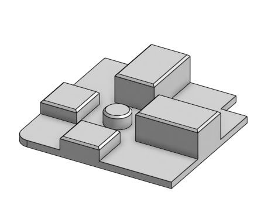

# 2020 TPU extrusion stopper

This is a very simple stopper for the corner extrusions of a 2020 printer to keep warm air and smells inside. It also works nicely to cover any sharp edges left by cutting the extrusion.

Print as oriented in any TPU you have on hand and plop onto your corners!
